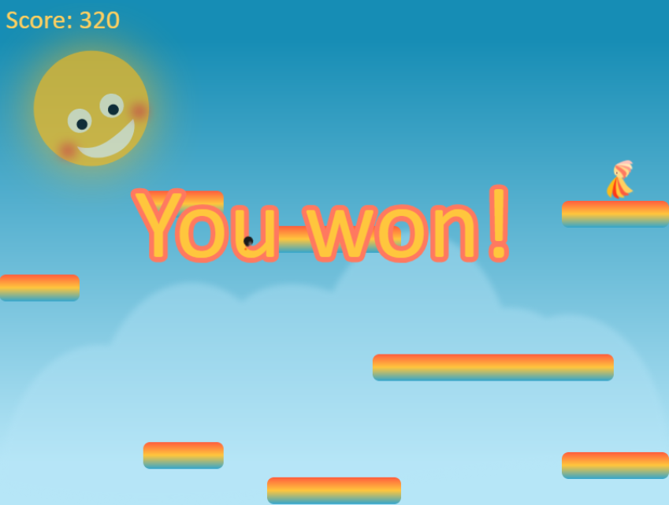

# 2018 November
[](https://travis-ci.org/ebabel-games/2018-november) [](https://david-dm.org/ebabel-games/2018-november.svg)

Collect all the stars as fast as possible! More and more deadly bombs will appear.



### Requirements
We need [Node.js](https://nodejs.org) to install and run scripts.

## Install and run
Run next commands in your terminal:

| Command | Description |
|---------|-------------|
| `npm install` | Install dependencies.|
| `npm test` | Lint the source code and run all automated tests.|
| `npm run build` | One-off build of the game.|
| `npm run watch` | Continuously build the game during development.|
| `npm start` | Build bundle and run game on localhost:8080. <br> Press `Ctrl + c` to kill **http-server** process. |

Browse to http://localhost:8080 to play the game.

## Deploy to Firebase
```
npm install -g firebase-tools
firebase login
firebase use --add [name of your Firebase app]
firebase deploy --only hosting
```

## Test localhost on a touch device
- [Check your local IP](https://www.whatismyip.com/) on your network (it should start with 192.168.).
- Put your touch device on the same network as your development machine (same Wifi for eample).
- Add the port :8080 to the IP.
- You should now be able to test the game running on your machine with your touch device.

## Switch the debug mode on or off
By default, debug mode is off. To switch it on, run in Javascript console of your browser:
```
localStorage['debug'] = true;
```

## Acceptance criterias
For each mini-game made in just 1 month, I want to hit as many as possible of these targets:
- [x] Player interactions are central to the game.
- [x] There is a clear outcome to the game: the player either wins or loses.
- [x] Graphics and animations are unique and created for the game.
- [ ] Sounds are unique and created for the game. (is not, at least Open source and Royalty Free)
- [x] Layout is responsive.
- [x] Single page app: It's possible to play the game multiple times without reloading the page.
- [x] Portrait and landscape modes are both supported.
- [x] Playable on the most popular (NL) touch device browsers at that time: Chrome69 for Android, Safari12 and 11.4 for iOS.
- [ ] Playable on the most popular (NL) desktop browsers at that time:
  - [ ] ~~IE11~~ (IE11 is not supported),
  - [x] Edge17,
  - [x] Firefox62,
  - [x] Chrome69,
  - [x] Chrome70,
  - [x] and Safari12.
- [x] Performance is stable enough with a good frame rate throughout the gaming experience (60 fps).
- [x] Unit tests, test coverage reporting, and linting are all setup.
- [ ] Test coverage is higher than 80%.
- [x] Travis CI build pipeline passes.
- [x] Semantic versioning and release tags standards are adhered to.
- [x] Published on [Firebase](https://firebase.google.com) to support HTTPS.
- [x] Listed on my [eBabel gaming website](https://ebabel.eu).
- [x] Works offline as a Progressive Web App (PWA) with CacheStorage.
- [x] Can be updated if a new version is made.
- [ ] Can be installed as a [Desktop Progressive Web App](https://developers.google.com/web/progressive-web-apps/desktop) with:
  - [ ] ~~IE11~~ (IE11 is not supported),
  - [ ] Edge17,
  - [ ] Firefox62,
  - [x] Chrome69,
  - [x] Chrome70,
  - [ ] and Safari12.
- [ ] Can be added to [homescreen on smartphone](https://developers.google.com/web/fundamentals/app-install-banners/) with:
  - [ ] ~~IE11~~ (IE11 is not supported),
  - [ ] Edge17,
  - [ ] Firefox62,
  - [ ] Chrome69,
  - [ ] Chrome70,
  - [ ] and Safari12.
